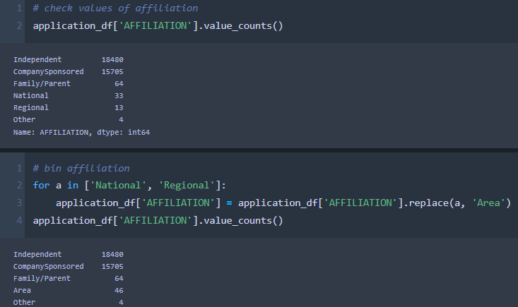

# Module 21 Challenge - Deep Learning
Python scripts by Peter Solis in Jupyter Notebook, code was written independently using the provided starter code & knowledge from class, alongside the resources listed below the analysis.

## Analysis
### Purpose
This analysis will explore the process of creating a sequential neural network model using tensorflow & keras in Python in order to analyze trends and predict the success of business proposals to the nonprofit Alphabet Soup before committing to any funding.
## Results
### Data Preprocessing
- The target variable for the model is the "IS_SUCCESSFUL" column of our dataset, which gives a binary classification as to whether or not the venture was successful.
- Relevant features of the dataset include:
  - Application Type - An arbitrary identifier for what type of Alphabet Soup application that data point is
  - Affiliation - An identifier classifying the part of the industry the application belongs to
  - Classification - What type of government organization the application represents
  - Use Case - What sector the funding will be used for / what the purpose of the application is
  - Organization - The type of organization applying
  - Status - Binary identifier giving active status of the application / applicant
  - Income Amount - Income bracket
  - Special Considerations - Binary identifier as to whether or not there are special considerations
  - Ask Amount - Amount of funding requested
### Compiling, Training, and Evaluating the Model
- To begin with, the neural network was built to the base standards.
  - Categorical data was changed to dummy columns with binary numerical values.
  - Categorical columns with more than 10 unique values were binned to group together rare cases.

  - Columns that had no relation to the success (not listed as relevant features) were dropped.
  - The number of nodes in the first layer were about double the number of inputs, with fewer nodes in the second hidden layer.
  - Activation functions were the usual ones we've used for classification thus far (ReLU and Sigmoid).
- This version of the model achieved a 72.4% accuracy on the test data, about 2.6% below the target.

- In attempts to reach the 75% goal, multiple routes were taken to try to improve it:
  - Binning a little less aggressively on classifications
  - Reducing unnecessary columns (like changing the Special Considerations column to be 1/0, instead of 2 binary columns, one for yes & one for no)
  - Binning income brackets more aggressively based on how common they were

  - Binning some values of affiliation that seemed related

  - Increasing nodes and epochs
- Other things attempted that had no (or negative) effects:
  - Dropping the Special Considerations and Status columns, which are almost exclusively one value (seem to basically cover outliers)
  - Binning more columns, such as less common use-cases or organizations
  - Adding an extra hidden layer
- Ultimately, this did not lead to an increase in accuracy, never breaking the 72.4% on test data

## Summary
Overall, I wasn't able to meet the 75% expected. Given time to test more iterations of the model, I'd be interested to try other activation functions, and even other neural network models. While it was easy to think "oh, this small amount of data isn't important, it's just distracting the model," almost every time I grouped or removed data that seemed like outliers or similar enough groups to me, it had little effect in improving accuracy or efficiency, often hurting the prior more than helping. I'd be interested to see how a tree-based machine learning model would approach the problem, if only to see what variables it considered most important, as I struggled to find a specific data point that was helping or hurting the result.

Another trend I found was that increasing the nodes / hidden layers / epochs didn't seem to have much of any impact on the model. In all the various attempts at improving it, the model always stagnated about 50 epochs in, never quite improving past 74.2% accuracy on the training data. This is largely why I think an entirely different model would be an interesting route to explore, even if it is less accurate, to try to explore what changes could improve the odds. (Pictured below are the original model at 50 and 100 epochs, as well as the "optimized" model at 50 and 120 epochs)

## Other Resources
https://stackoverflow.com/questions/22320356/pandas-get-values-from-column-that-appear-more-than-x-times - filtering unique value counts too those that occur a certain number of times

https://www.tensorflow.org/api_docs/python/tf/keras/callbacks/ModelCheckpoint - creating a callback to save model weights
